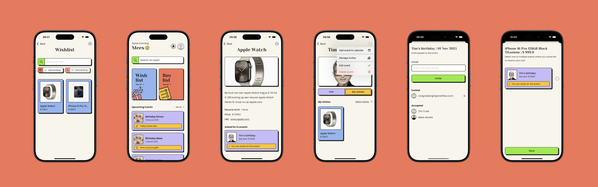
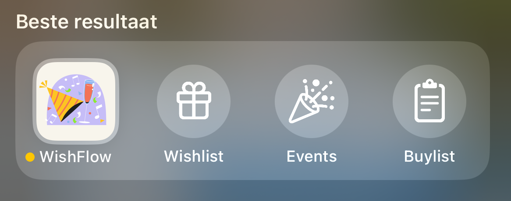
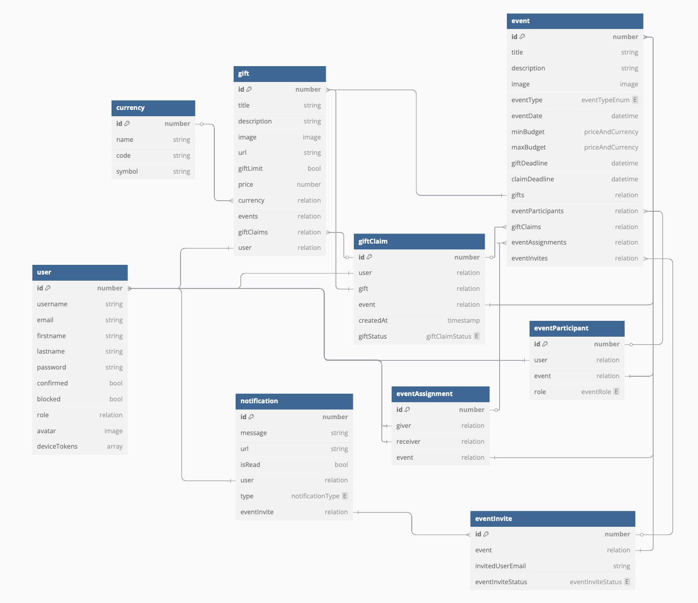

# Wishflow

WishFlow makes it easy to manage wish lists and gift groups for any occasion. With features like retreiving gift data and gift assignments, users can prevent duplicate presents and ensure a smooth gifting experience.

 

## Technical Information
- **iOS app**: Swift(UI)
- **Backend**: [Strapi Headless CMS](#strapi-headless-cms) (Node.js) v5.11.2
- **Database**: PostgreSQL
- **API Framework**: [StrapiSwift](https://github.com/meesakveld/strapi-swift) (Swift 6.0 Package)
- **Parsing data from URL**: [SwiftSoup](https://github.com/scinfu/SwiftSoup)
- **Notifications**: [@parse/node-apn](https://www.npmjs.com/package/@parse/node-apn) (Node.js Package)
- **Authentication**: Strapi JWT (Stored in [Keychain](https://github.com/jrendel/SwiftKeychainWrapper) - only on device)

### Hosting

- **iOS app**: [App Store Connect](https://developer.apple.com/app-store-connect/)
- **Strapi Headline CMS**: [Render.com](https://render.com)
- **Database**: [Aiven.io](https://aiven.io/postgresql)

 

## Features

### App Features

- **Onboarding**: Users can create an account or login with an existing account.
- **Events**: Users can create, edit, delete, and get their events.
- **Wishes**: Users can add, edit, delete, and get their wishes.
- **Add a Wish using a URL**: Users can add a wish by providing a URL, the app will fetch the JSON-LD data to get the title, image, description, and price if available.
- **Buylist**: User can view their buylist and mark items as bought based on which gifts they have selected to buy.

### Native iOS Feature integrations
- **Deep Linking**: Users can navigate to the app from a link.
- **Calendar**: Users can add events to their calendar, also utilizing the deep linking feature to go directly to the event in the app.
- **Notifications**: Users can receive notifications.
- **Spotlight Quick Actions**: Users can click directly on the button wishlist, events or buylist to navigate to the app and see the content.
  
  By providing the spotlight quick actions, users can also use these actions with Siri and Shortcuts.

  

 

## Back-end

The backend is built with Strapi, a headless CMS that allows for easy management of content and data. The API is built using the Strapi framework, which provides a RESTful API for the iOS app to interact with.

Strapi is hosted on Render.com, a cloud platform that provides hosting for web applications. The database is hosted on Aiven.io, a cloud database provider that offers PostgreSQL as a service.

### Database structure

The database structure for the WishFlow app is designed to be simple and easy to manage. The database consists of the following collections:

| Collection | Description |
| --- | --- |
| User | Stores user information such as username, email, and password. |
| Currency | Stores currency information such as name, symbol, and symbol. |
| Gift | Stores gift information such as title, description, price, image and the user who added the gift. |
| Event | Stores event information such as title, description, eventDate and image. |
| GiftClaim | Stores gift claim information such as the user who claimed the gift and the gift that was claimed. |
| EventParticipant | Stores event participant information such as the user who is participating in the event, the event they are participating in and their role. |
| EventAssignment | When an event has the eventType oneToOne (eg: Secret Santa), the giver and receiver are stored in this collection. |
| EventInvite | Stores event invite information such as the email of the invited user, the event they are invited to and the status of the invite. |
| Notification | Stores notification information such as the user who the notification is for, the message and the type of notification. |

 

 

## Contact
If you have any questions or need further assistance, please feel free to contact me on LinkedIn or on my website.

